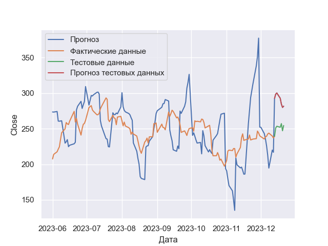

## Модель Хольта-Уинтерса

Метод прогнозирования временных рядов. Эта модель учитывает как тренд (увеличивающийся или уменьшающийся шаблон в данных),
так и сезонность (повторяющиеся шаблоны в пределах определенного периода времени).

### Работа с алгоритмом

Для работы с реализованным алгоритмом, достаточно передать в конструктор класса HoltWinters ряд предсталвенный
в виде pandas.Series, а также все гиперпараметры: L (длина сезона), alphas (массив альф).

В качестве примера представлена работа алгоритма на котировках Tesla:
