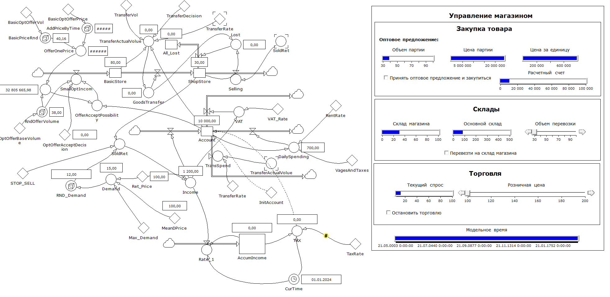
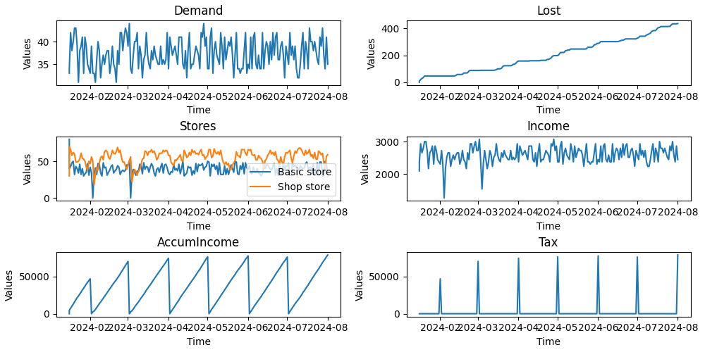

## Системно-динамическое моделирование

В данной работе представлена система построенная в программе PowerSim Studio, которая
моделирующего поведение магазина.
Полученная модель представлена ниже:

В данной модели был добавлен учет налога на прибыль в конце месяца. Представлено это в AccumeIncome и Tax.

Также модель была переведена в код, с учетом всех зависимостей внутри модели.
Результаты моделирования при помощи данной программы представлен ниже

