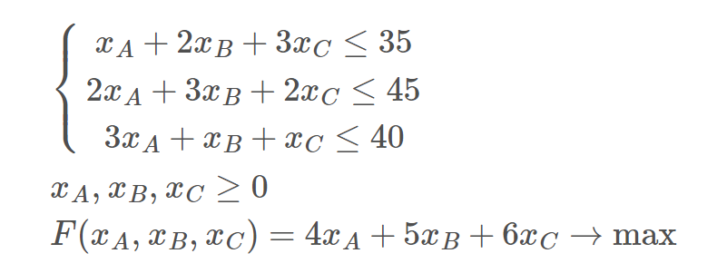

## Симплекс-метод
### Описание:
Алгоритм решения оптимизационной задачи линейного программирования путём перебора вершин выпуклого многогранника 
в многомерном пространстве.

Данный модуль реализует алгоритм симплекс-метода и позволяет решать задачу оптимизации линейного программирования.

### Способ работы
Необходимо заполнить файл task, сначала заполняется целевая функция, затем все ограничения функции. Важно, чтобы разделительные
полосы оставались в файле.
Далее при запуске алгоритма будут выведены все итерации симплекс-таблицы, итоговый вектор и значение функции в данной точке.

### Задача
| Ресурс  | Изделия А | Изделия B | Изделия C | Ресурсов на складе |
|---------|-----------|-----------|-----------|--------------------|
| R1      | 1         | 2         | 3         | 35                 |
| R2      | 2         | 3         | 2         | 45                 |
| R3      | 1         | 1         | 1         | 40                 |
| Прибыль | 4         | 5         | 6         |                    |

