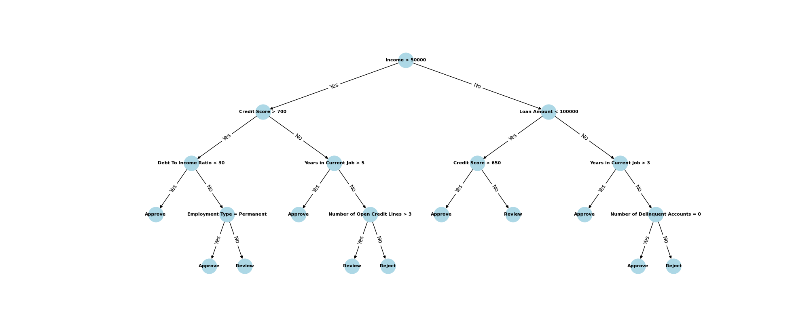

## Деревья решений

Задача: Одобрение кредита на основе параметров заемщика.

Результат: Дерево решений и программный код, позволяющий оценить 
целесообразность выдачи кредита данному заемщику.

Описание работы программы:
* Генерация случайных заемщиков
* Выставление оценки каждому сгенерированному агенту
* Вывод датафрейма с параметрами агента и выставленной оценкой
* Вывод изображения сгенерированного дерева

