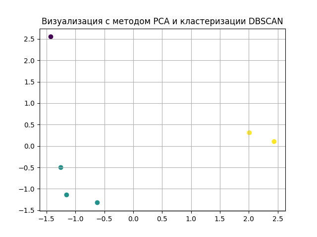

##  Обработка экспертных оценок
 Экспертные оценки представляют собой субъективные суждения специалистов в определенной области, основанные на их знаниях и опыте.
 Чтобы эффективно использовать экспертные оценки, необходимо их правильно обработать и проанализировать. 
 Данная работа посвящена обработки данных оценок.
 
В результате выполнения кода, получаем: вектор оценки экспертов, вектор квалификации экспертов, а также kendall's W оценку.

Также строится визуализация с помощью сокращения размерности данных методом PCA.
А также кластеризации с помощью метода DBSCAN.
