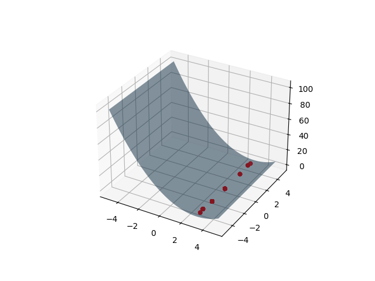

## Оптимизация с помощью генетических алгоритмов

Генетический алгоритм - это метод оптимизации, вдохновленный процессом естественного отбора, который используется в биологии. Этот алгоритм отражает процесс эволюции, где более сильные особи выбираются для воспроизведения, чтобы передать свои гены следующему поколению.

В контексте оптимизации функции, генетический алгоритм используется для поиска глобального максимума или минимума функции. В случае функции от двух переменных, каждое решение или "особь" представляет собой пару значений (x, y), которые подставляются в функцию. Цель состоит в том, чтобы найти такую пару (x, y), при которой функция достигает своего экстремального значения.

Ниже представлена визуализации шагов движения алгоритма оптимизации, в данном случае отмечено движение лучшей особи каждой эпохи:

Если сравнивать результаты алгоритма Пиявского и Генетического, то видно, что ГА показывает нестабильные результаты так, как 
важной частью алгоритма является случайность. Но при этом реализация ГА сильно проще алгоритма Пиявского, а также расширение на двух и более мерные пространства для 
генетического реализуются значительно проще.

Что касается времени выполнения, то алгоритм Пиявского вычисляется 